# 基于Springboot的校园周边美食探索及分享平台 

## Springboot-0021


## 技术栈

Springboot mybatisplus vue mysql maven


## 数据库表(9张)


## 功能介绍

```properties
管理员；首页、个人中心、用户管理、美食鉴赏管理、我的好友管理、我的收藏管理、系统管理，前台首页；首页、美食鉴赏、我的好友、个人中心、后台管理，用户后台；首页、个人中心、美食鉴赏管理、我的好友管理、我的收藏管理等功能
```


## 图片

### 前台

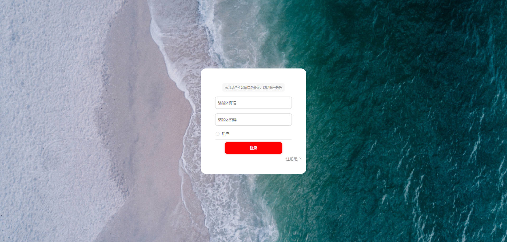

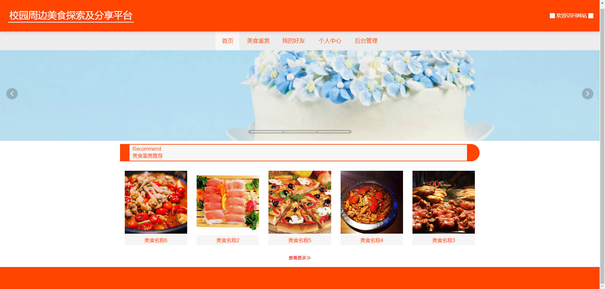


### 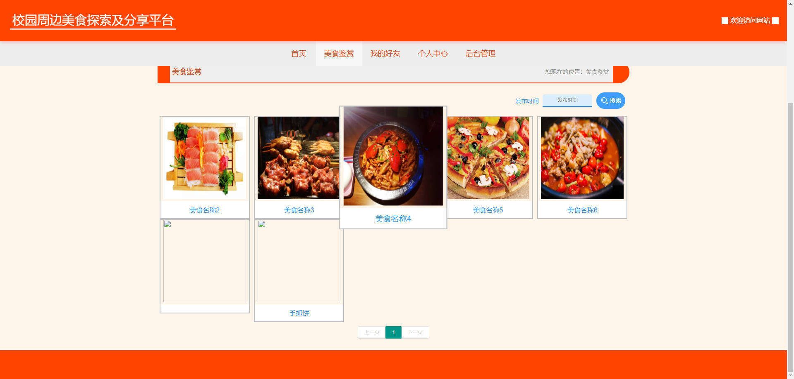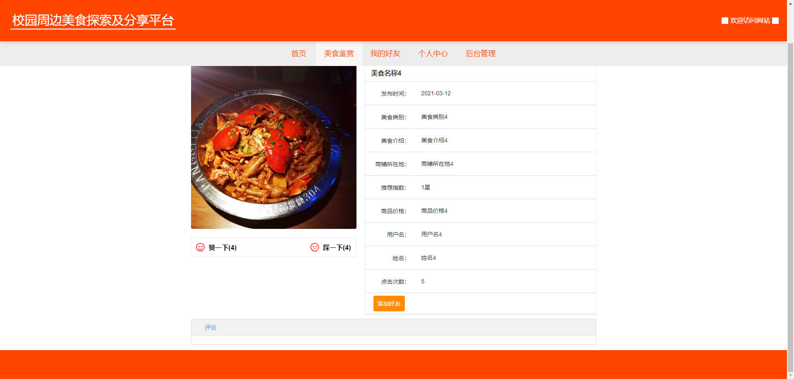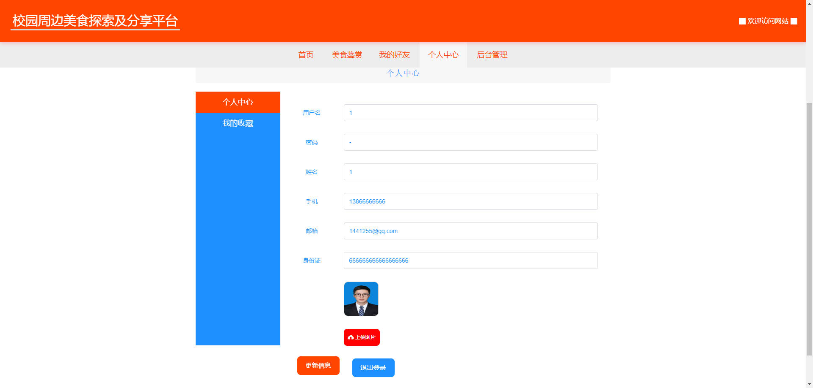后台

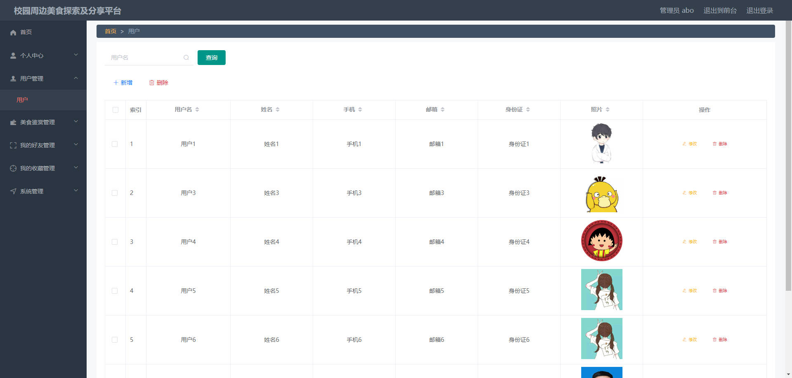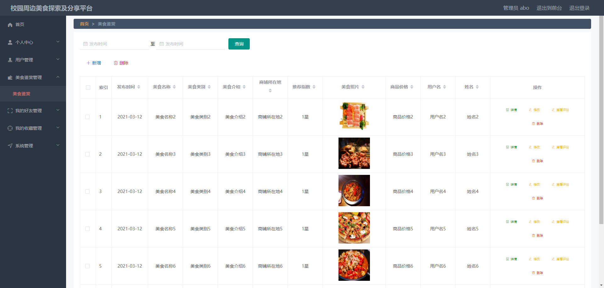

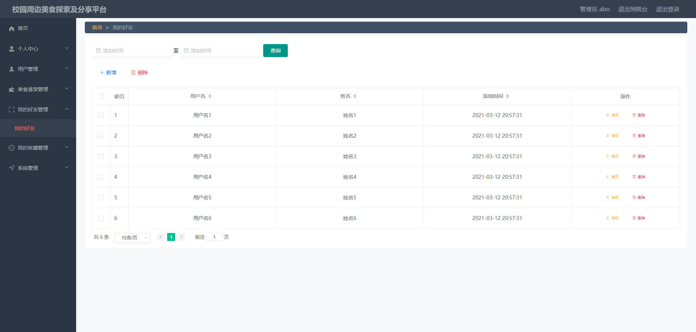

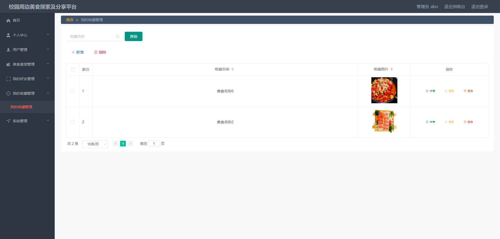

## 访问路径

### 前台

```properties
http://localhost:8080/springboot35l3z/front/pages/login/login.html

账号 1
密码 1
```

### 后台

```properties
http://localhost:8080/springboot35l3z/admin/dist/index.html#/login

账号 abo
密码 123456
```


## 功能图

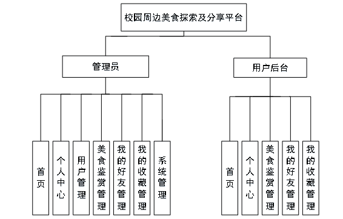


## 文档目录

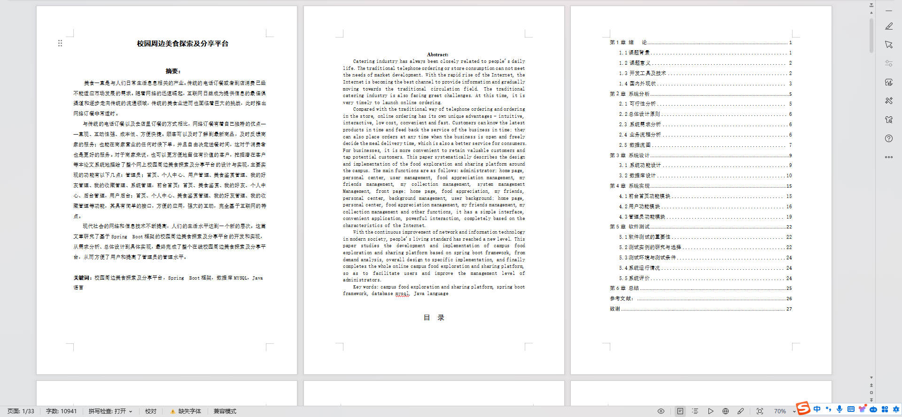


## 打赏或交流


